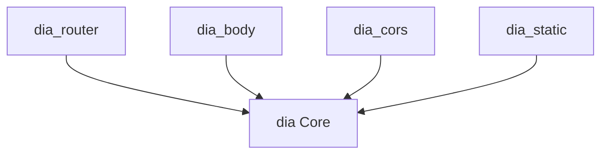

# AI Assistant Guide для Dia Framework

Руководство для AI-ассистентов при работе с проектом Dia.

## Обзор проекта

**Dia** - минималистичный HTTP фреймворк для Dart, вдохновленный KoaJS.

### Ключевые характеристики

- 🎯 **Минималистичный** - только базовый функционал в core
- 🔌 **Модульный** - расширения через отдельные пакеты
- 🔄 **Middleware-based** - композиция через middleware chain
- 🎨 **Расширяемый** - Context расширяется через наследование и mixins
- 🛡️ **Типобезопасный** - generics для compile-time проверок

### Структура монорепозитория

```
dia/
├── packages/
│   ├── dia/           # Core: HTTP server, middleware, context
│   ├── dia_router/    # URL routing с параметрами
│   ├── dia_body/      # Body parser (JSON, form, multipart)
│   ├── dia_cors/      # CORS middleware
│   └── dia_static/    # Static file serving
├── melos.yaml         # Monorepo конфигурация
└── .cursor/rules/     # Правила для Cursor AI
```

## Философия проекта

### Минимализм

**Core пакет** (`dia`) содержит **только** необходимое:
- HTTP/HTTPS сервер
- Middleware композиция
- Базовый Context
- Error handling (HttpError)
- Request hijacking

**Всё остальное** - отдельные пакеты:
- Routing → `dia_router`
- Body parsing → `dia_body`
- CORS → `dia_cors`
- Static files → `dia_static`

### Расширяемость

Функциональность добавляется через:
- **Middleware** - для обработки запросов
- **Context расширения** - через наследование или mixins
- **Отдельные пакеты** - для новых фич

### Консистентность

- Единый паттерн middleware во всех пакетах
- Одинаковый подход к error handling
- Согласованное именование API (`use`, `listen`, `close`)
- Общие lint правила для всех пакетов

## Ключевые концепции

### 1. Middleware Pattern

```dart
typedef Middleware<T extends Context> = Future<void> Function(
  T ctx,
  FutureOr<void> Function() next,
);
```

Middleware выполняются последовательно:

```dart
app.use((ctx, next) async {
  print('Before');      // Код ДО
  await next();         // Передать управление
  print('After');       // Код ПОСЛЕ (в обратном порядке)
});
```

**Правила:**
- ВСЕГДА вызывай `await next()` для продолжения цепочки
- НЕ вызывай `next()` если обработал запрос (`ctx.body` установлен)
- НЕ вызывай `next()` более одного раза

### 2. Context Pattern

Context оборачивает `HttpRequest`/`HttpResponse`:

```dart
class Context {
  final HttpRequest _request;
  late dynamic body;
  
  // Удобные геттеры
  HttpRequest get request;
  HttpResponse get response;
  int get statusCode;
  set statusCode(int code);
  
  // Утилиты
  void throwError(int status, {...});
  Never hijack(Function callback);
}
```

**Расширение через наследование:**

```dart
class CustomContext extends Context {
  String? userId;
  CustomContext(HttpRequest request) : super(request);
}

final app = App((request) => CustomContext(request));
```

**Расширение через Mixins:**

```dart
mixin Routing on Context {
  Map<String, String> params = {};
  Map<String, String> query = {};
}

class ContextWithRouting extends Context with Routing {
  ContextWithRouting(HttpRequest request) : super(request);
}
```

### 3. Router Pattern

Router требует Context с `Routing` mixin:

```dart
final router = Router<ContextWithRouting>('/api');

router.get('/users/:id', (ctx, next) async {
  final id = ctx.params['id'];  // Path параметр
  final filter = ctx.query['filter'];  // Query параметр
  ctx.body = 'User $id';
});

app.use(router.middleware);
```

### 4. Error Handling

```dart
// Генерация HTTP ошибки
ctx.throwError(404, message: 'Not found');

// С exception и stackTrace
ctx.throwError(500, exception: e, stackTrace: stackTrace);

// HttpError автоматически обрабатывается middleware композицией
```

## При работе с кодом

### Важно: FVM

**Проект использует FVM (Flutter Version Manager).** Все команды должны выполняться через `fvm`:

```bash
# Установка FVM и Flutter
fvm install

# Примеры команд
fvm dart test
fvm flutter analyze
fvm melos bootstrap
```

### Обязательные проверки

1. **ВСЕГДА проверяй `analysis_options.yaml`**
   - Lint правила должны соблюдаться
   - Используй `fvm melos run analyze` перед коммитом

2. **Используй Melos для операций над пакетами**
   ```bash
   fvm melos bootstrap          # Установка зависимостей
   fvm melos run lint:all       # Lint + format
   fvm melos run test           # Все тесты
   ```

3. **Следуй существующим паттернам**
   - Изучи `packages/dia/lib/src/app.dart` для middleware композиции
   - Изучи `packages/dia_router/lib/src/router.dart` для routing паттернов

4. **Поддерживай консистентность API**
   - Методы: camelCase
   - Классы: PascalCase
   - Приватные: `_prefix`

5. **Добавляй тесты для нового функционала**
   - Integration тесты с реальным HTTP сервером
   - Используй `http` пакет для клиента
   - Изолируй тесты через разные порты

### Паттерны разработки

#### Создание middleware

```dart
// Простой middleware
Middleware<Context> logger() {
  return (ctx, next) async {
    print('${ctx.request.method} ${ctx.request.uri}');
    await next();
  };
}

// Middleware с параметрами
Middleware<Context> timeout(Duration duration) {
  return (ctx, next) async {
    await next().timeout(duration);
  };
}

// Использование
app.use(logger());
app.use(timeout(Duration(seconds: 30)));
```

#### Создание роутера

```dart
// Группировка роутов
final usersRouter = Router<ContextWithRouting>('/users');
usersRouter.get('/', listUsers);
usersRouter.post('/', createUser);
usersRouter.get('/:id', getUser);
usersRouter.put('/:id', updateUser);
usersRouter.delete('/:id', deleteUser);

app.use(usersRouter.middleware);
```

#### Custom Context

```dart
// Определение
class AppContext extends Context with Routing {
  String? userId;
  Map<String, dynamic>? sessionData;
  
  AppContext(HttpRequest request) : super(request);
}

// Использование
final app = App<AppContext>((request) => AppContext(request));

app.use((ctx, next) async {
  // Доступ к кастомным полям
  ctx.userId = extractUserId(ctx);
  await next();
});
```

### Частые задачи

#### Добавление нового пакета

1. Создай структуру в `packages/new_package/`
2. Скопируй `pubspec.yaml` и `analysis_options.yaml` из существующего пакета
3. Создай главный экспорт: `lib/new_package.dart`
4. Добавь зависимость на `dia`: `^0.1.5`
5. Запусти `melos bootstrap`
6. Добавь тесты в `test/`
7. Напиши README.md с примерами

#### Изменение в core пакете

**ОСТОРОЖНО:** Core должен быть стабильным!

1. Проверь что изменение не breaking change
2. Добавь/обнови тесты
3. Обнови CHANGELOG.md
4. Запусти полный набор тестов: `melos run test`
5. Проверь что зависимые пакеты не сломались

#### Версионирование

```bash
# На main ветке
git checkout main
git merge feature-branch

# Интерактивное версионирование
melos version

# Выбери пакеты и тип версии (major/minor/patch)
# Обнови CHANGELOG.md
# Melos создаст git tag
```

### Типичные ошибки

❌ **НЕ делай:**

```dart
// Множественный вызов next()
await next();
await next();  // ОШИБКА!

// Забыл await
next();  // ОШИБКА: должно быть await next()

// Мутация Context в неправильном месте
ctx.body = 'result';
await next();  // Бессмысленно - body уже установлен

// Breaking change в core без major version
// Изменение сигнатуры Middleware typedef
```

✅ **Делай:**

```dart
// Правильный middleware
app.use((ctx, next) async {
  // Pre-processing
  await next();
  // Post-processing
});

// Правильная остановка цепочки
app.use((ctx, next) async {
  ctx.body = 'result';
  // НЕ вызываем next() - запрос обработан
});

// Правильная обработка ошибок
try {
  await dangerousOperation();
} catch (e, stackTrace) {
  ctx.throwError(500, exception: e, stackTrace: stackTrace);
}
```

## Структура правил

Проект содержит детальные правила в `.cursor/rules/`:

- **`dart-coding-standards.md`** - стиль кода, именование, импорты, lint правила
- **`architecture-patterns.md`** - middleware, context, error handling паттерны
- **`monorepo-workflow.md`** - работа с Melos, зависимости, версионирование
- **`testing-guidelines.md`** - integration тесты, setUp/tearDown, изоляция
- **`dia-core.md`** - правила для core пакета, API design, стабильность
- **`dia-router.md`** - routing паттерны, path matching, вложенные роутеры
- **`dia-websocket.md`** - WebSocket upgrade, protocol negotiation, security

**Используй эти правила** как референс при работе с кодом.

## Ссылки на ключевые файлы

### Конфигурация

- [`melos.yaml`](melos.yaml) - конфигурация монорепозитория
- [`packages/dia/analysis_options.yaml`](packages/dia/analysis_options.yaml) - lint правила

### Core реализация

- [`packages/dia/lib/src/app.dart`](packages/dia/lib/src/app.dart) - App класс, middleware композиция
- [`packages/dia/lib/src/context.dart`](packages/dia/lib/src/context.dart) - Context класс, hijacking
- [`packages/dia/lib/src/http_error.dart`](packages/dia/lib/src/http_error.dart) - HttpError класс

### Router реализация

- [`packages/dia_router/lib/src/router.dart`](packages/dia_router/lib/src/router.dart) - Router класс
- [`packages/dia_router/lib/src/routing_mixin.dart`](packages/dia_router/lib/src/routing_mixin.dart) - Routing mixin

### Примеры

- [`packages/dia/example/`](packages/dia/example/) - примеры использования core
- [`packages/dia_router/example/`](packages/dia_router/example/) - примеры routing

### Тесты

- [`packages/dia/test/`](packages/dia/test/) - тесты core функциональности
- [`packages/dia_router/test/`](packages/dia_router/test/) - тесты router

## Диаграмма зависимостей



Все пакеты зависят от `dia`, но НЕ зависят друг от друга.

## Быстрый старт для новых контрибьюторов

### 1. Setup

```bash
# Клонируй репозиторий
git clone https://github.com/unger1984/dia.git
cd dia

# Установи Flutter через FVM
fvm install

# Установи зависимости
fvm melos bootstrap

# Проверь что всё работает
fvm melos run test
```

### 2. Изучи структуру

```bash
# Список всех пакетов
fvm melos list

# Граф зависимостей
fvm melos list --graph
```

### 3. Создай ветку

```bash
git checkout -b feat/your-feature
```

### 4. Разработка

```bash
# Работай в конкретном пакете
cd packages/dia_router

# Запускай тесты
fvm dart test

# Или из корня
fvm melos exec --scope=dia_router -- dart test
```

### 5. Проверка перед коммитом

```bash
# Полная проверка
fvm melos run lint:all

# Все тесты
fvm melos run test
```

### 6. Коммит

```bash
git add .
git commit -m "feat(router): add nested router support"
```

### 7. Pull Request

Создай PR с описанием изменений и ссылкой на issue (если есть).

## Рекомендации по созданию нового функционала

### Новый middleware пакет

1. **Минимализм** - одна фича на пакет
2. **Документация** - README с примерами
3. **Тесты** - integration тесты обязательны
4. **Типобезопасность** - используй generics
5. **Расширяемость** - позволь кастомизацию через параметры

### Изменения в core

1. **Обсуждение** - создай issue для обсуждения
2. **Backward compatibility** - избегай breaking changes
3. **Тесты** - покрывай все edge cases
4. **Документация** - обнови README и примеры
5. **CHANGELOG** - документируй все изменения

### Новые фичи в существующих пакетах

1. **Консистентность** - следуй существующему стилю
2. **Не раздувай** - не добавляй несвязанную функциональность
3. **Optional** - делай новые фичи opt-in
4. **Версионирование** - minor version для новых фич

## Вопросы и поддержка

- **Issues**: https://github.com/unger1984/dia/issues
- **Discussions**: используй GitHub Discussions для вопросов
- **Pull Requests**: приветствуются! Следуй guidelines выше

## Changelog и история

При работе с кодом **ВСЕГДА обновляй CHANGELOG.md** в соответствующем пакете:

```markdown
## Unreleased

### Added
- New feature description

### Fixed
- Bug fix description

### Changed
- Breaking change description (если есть)
```

---

**Помни:** Dia - это минималистичный фреймворк. Добавляя новый функционал, спроси себя: "Это должно быть в core, или это отдельный пакет?"
