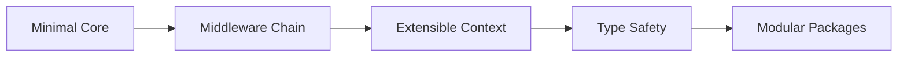
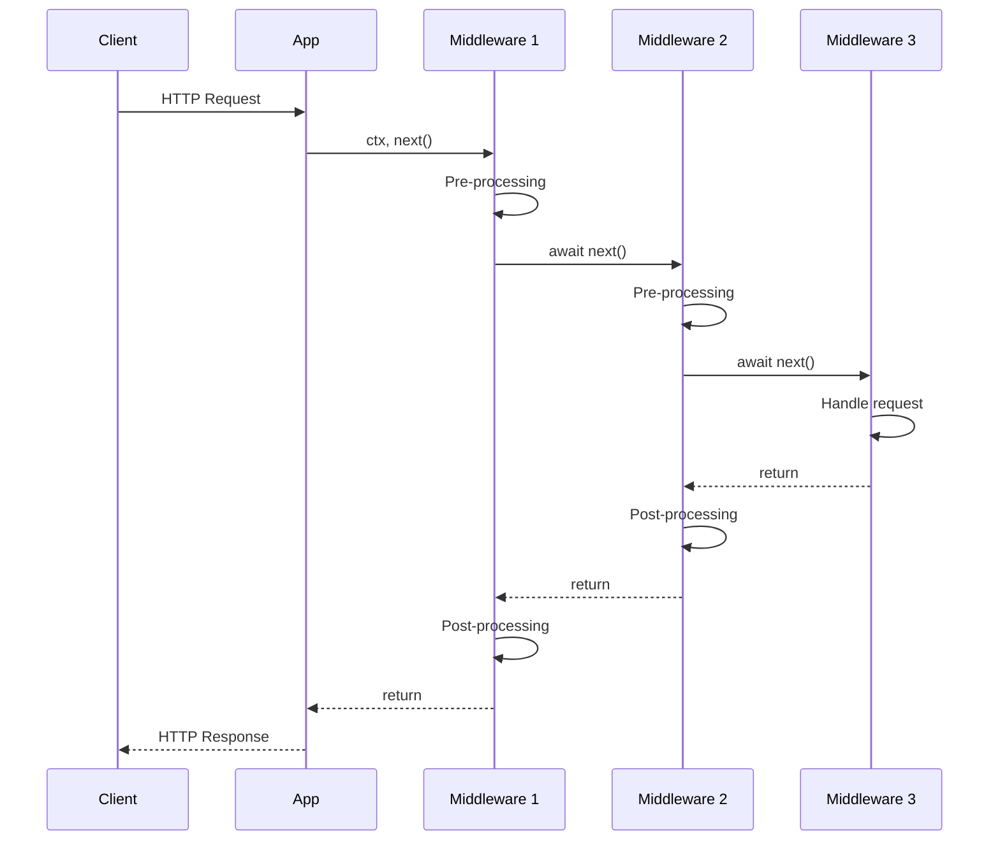
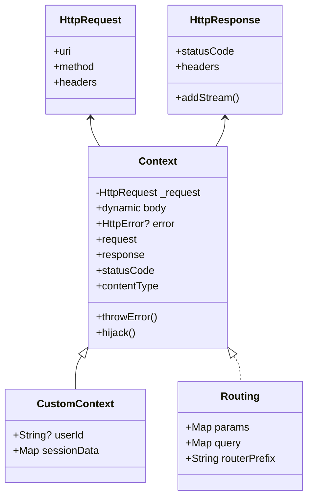
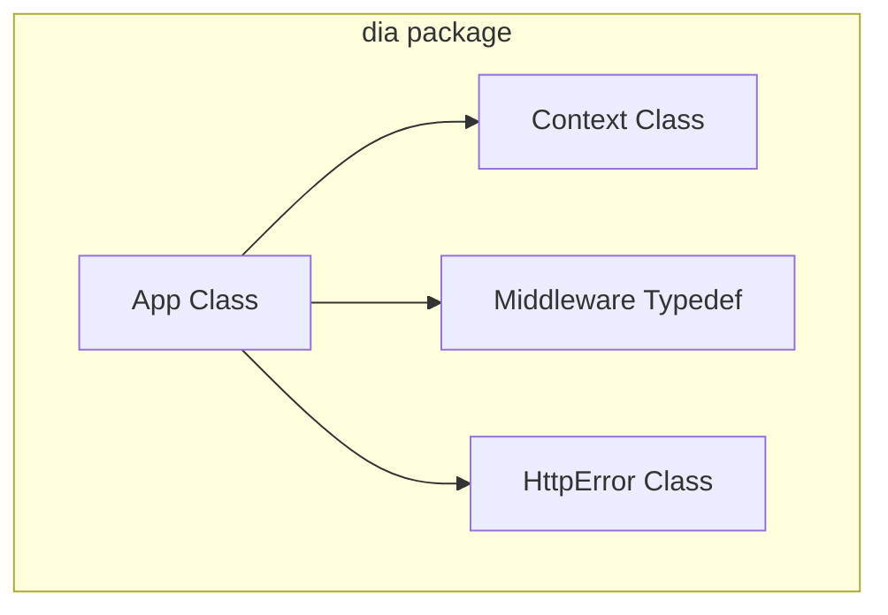
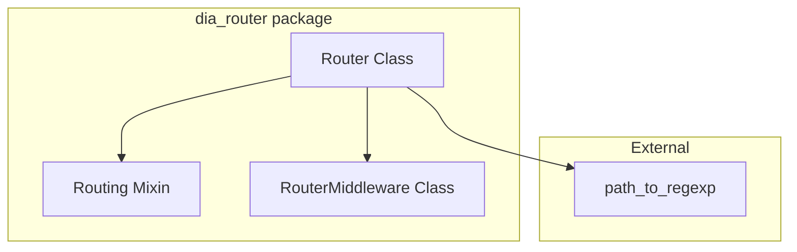
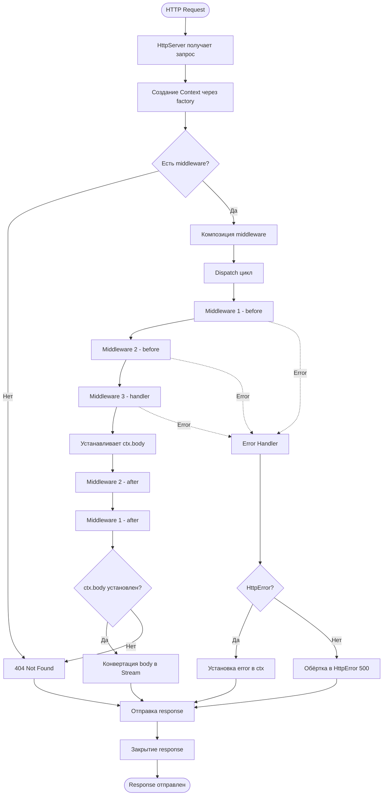
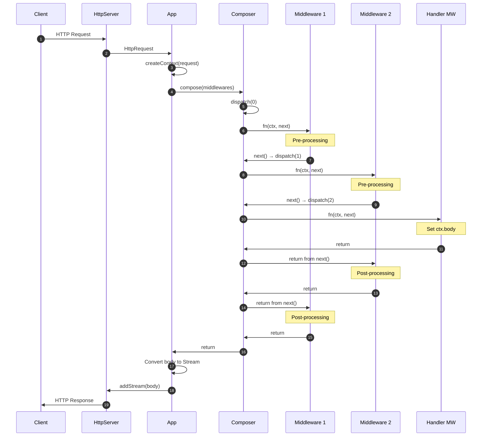
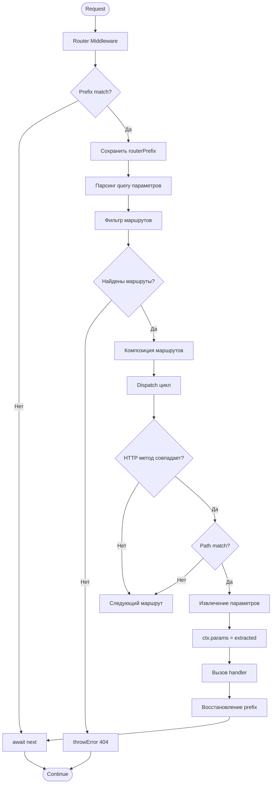
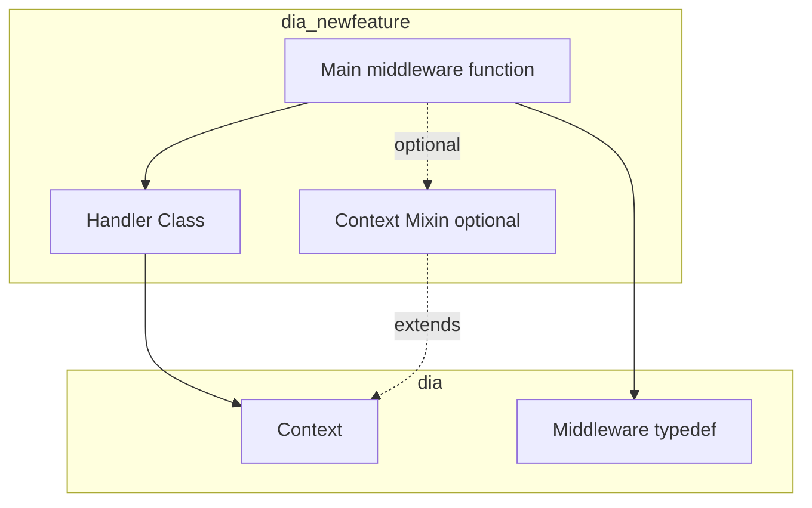
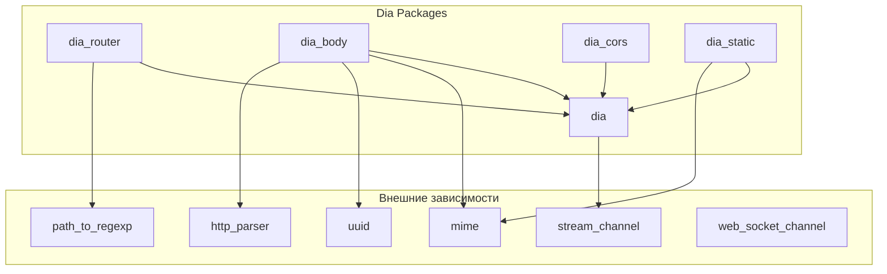

# Dia Framework Architecture

Детальное описание архитектуры Dia HTTP фреймворка.

## Содержание

- [Обзор](#обзор)
- [Философия дизайна](#философия-дизайна)
- [Архитектурные паттерны](#архитектурные-паттерны)
- [Компоненты системы](#компоненты-системы)
- [Жизненный цикл запроса](#жизненный-цикл-запроса)
- [Расширение системы](#расширение-системы)
- [Зависимости пакетов](#зависимости-пакетов)

## Обзор

Dia - минималистичный HTTP фреймворк для Dart, вдохновленный архитектурой KoaJS. Основан на паттерне middleware для обработки HTTP запросов.

### Ключевые характеристики



- **Минималистичный core** - только базовая функциональность
- **Middleware chain** - композиция обработчиков
- **Расширяемый Context** - через наследование и mixins
- **Типобезопасность** - generics для compile-time проверок
- **Модульность** - функции в отдельных пакетах

## Философия дизайна

### 1. Минимализм

Core пакет `dia` предоставляет минимум необходимого:

```dart
// Core функциональность
- HTTP/HTTPS сервер (io.HttpServer)
- Middleware композиция
- Context wrapper
- HttpError обработка
- Request hijacking
```

Всё остальное - отдельные пакеты:
- `dia_router` - routing
- `dia_body` - body parsing
- `dia_cors` - CORS
- `dia_static` - static files

### 2. Композиция над наследованием

Функциональность добавляется через композицию middleware:

```dart
app.use(logger());
app.use(cors());
app.use(bodyParser());
app.use(router.middleware);
```

Не через наследование классов:

```dart
// ❌ НЕ используем
class MyApp extends App with Logger, Cors, BodyParser { }
```

### 3. Типобезопасность

Generic типы для compile-time гарантий:

```dart
class App<T extends Context> { }
class Router<T extends Routing> { }
typedef Middleware<T extends Context> = Future<void> Function(T, next);
```

## Архитектурные паттерны

### Middleware Pattern

Центральный паттерн фреймворка:



**Характеристики:**
- Последовательное выполнение
- Bidirectional (до и после `next()`)
- Stack-like execution (LIFO для post-processing)
- Централизованная обработка ошибок

### Context Pattern

Context оборачивает HttpRequest/HttpResponse:



**Расширения:**
- Наследование для дополнительных полей
- Mixins для группированной функциональности
- Factory функции для создания кастомных контекстов

### Composition Pattern

Middleware композиция через dispatch функцию:

```dart
Function _compose(List<Middleware<T>> middlewares) {
  return (T ctx, Middleware<T>? next) {
    var lastCalledIndex = -1;
    
    FutureOr dispatch(int currentCallIndex) async {
      // Защита от множественного next()
      if (currentCallIndex <= lastCalledIndex) {
        throw Exception('next() called multiple times');
      }
      
      lastCalledIndex = currentCallIndex;
      var fn = middlewares[currentCallIndex];
      
      // Рекурсивный вызов следующего middleware
      return fn(ctx, () => dispatch(currentCallIndex + 1))
          .catchError((error, stackTrace) {
        // Централизованная обработка ошибок
        handleError(ctx, error, stackTrace);
      });
    }
    
    return dispatch(0);
  };
}
```

## Компоненты системы

### Core Package (dia)



#### App Class

Основной класс приложения:

```dart
class App<T extends Context> {
  late HttpServer _server;
  final List<Middleware<T>> _middlewares = [];
  late Function(HttpRequest) _createContext;
  
  // Регистрация middleware
  void use(Middleware<T> middleware);
  
  // Запуск сервера
  Future<void> listen(address, int port, {...});
  Future<void> listenOn(ServerSocket serverSocket);
  
  // Остановка
  void close();
  
  // Приватные методы
  Future<void> _listen();
  Function _compose(List<Middleware<T>> middlewares);
  void _responseHttpError(T ctx, HttpError error);
}
```

#### Context Class

Обёртка над HttpRequest/HttpResponse:

```dart
class Context {
  final HttpRequest _request;
  late dynamic body;
  HttpError? error;
  late final _OnHijack _onHijack;
  
  // Геттеры для удобного доступа
  HttpRequest get request;
  HttpResponse get response;
  HttpHeaders get headers;
  int get statusCode;
  set statusCode(int code);
  ContentType? get contentType;
  set contentType(ContentType? type);
  
  // Утилиты
  void set(String key, String value);
  void throwError(int status, {...});
  Never hijack(Function callback);
}
```

#### HttpError Class

Представление HTTP ошибки:

```dart
class HttpError extends Error {
  final int _status;
  late String _message;
  late Exception? _exception;
  late final StackTrace? _stackTrace;
  
  String get message;
  int get status;
  Exception? get exception;
  StackTrace? get stackTrace;
  String get defaultBody;  // HTML страница ошибки
}
```

### Router Package (dia_router)



#### Router Class

URL-based routing:

```dart
class Router<T extends Routing> {
  late final String _prefix;
  final List<RouterMiddleware<T>> _routerMiddlewares = [];
  
  // HTTP методы
  void get(String path, Middleware<T> middleware);
  void post(String path, Middleware<T> middleware);
  void put(String path, Middleware<T> middleware);
  void delete(String path, Middleware<T> middleware);
  void all(String path, Middleware<T> middleware);
  
  // Общие middleware
  void use(Middleware<T> middleware);
  
  // Middleware для App
  Middleware<T> get middleware;
  
  // Приватные методы
  Future<void> _handle(T ctx);
  Function _composeRouterMiddlewares(...);
  List<String> _getAllow(T ctx);
}
```

#### Routing Mixin

Расширение Context для routing:

```dart
mixin Routing on Context {
  Map<String, String> _params = {};
  final Map<String, String> _query = {};
  String routerPrefix = '';
  
  Map<String, String> get params;
  set params(Map<String, String> params);
  Map<String, String> get query;
}
```

## Жизненный цикл запроса

### Полный цикл



### Детальный поток middleware



### Router request flow



## Расширение системы

### Создание Middleware

```dart
// Простой middleware
Middleware<Context> logger() {
  return (ctx, next) async {
    final start = DateTime.now();
    await next();
    final duration = DateTime.now().difference(start);
    print('${ctx.request.method} ${ctx.request.uri} - ${duration.inMilliseconds}ms');
  };
}

// С параметрами
Middleware<Context> cors({List<String>? origins}) {
  return (ctx, next) async {
    if (origins != null) {
      final origin = ctx.request.headers.value('Origin');
      if (origin != null && origins.contains(origin)) {
        ctx.set('Access-Control-Allow-Origin', origin);
      }
    } else {
      ctx.set('Access-Control-Allow-Origin', '*');
    }
    await next();
  };
}
```

### Расширение Context

#### Через наследование

```dart
class AppContext extends Context {
  String? userId;
  Map<String, dynamic>? sessionData;
  
  AppContext(HttpRequest request) : super(request);
}

final app = App<AppContext>((request) => AppContext(request));
```

#### Через Mixin

```dart
mixin Authentication on Context {
  String? _userId;
  
  String? get userId => _userId;
  
  Future<void> authenticate(String token) async {
    _userId = await validateToken(token);
  }
  
  bool get isAuthenticated => _userId != null;
}

class AppContext extends Context with Authentication, Routing {
  AppContext(HttpRequest request) : super(request);
}
```

### Создание нового пакета



**Структура:**

```dart
// lib/dia_newfeature.dart
library dia_newfeature;

export 'src/handler.dart';
export 'src/mixin.dart';  // если есть

// Main function
Middleware<T> newFeature<T extends Context>({
  required options,
}) {
  return Handler<T>(options).handle;
}

// lib/src/handler.dart
class Handler<T extends Context> {
  final Options _options;
  
  Handler(this._options);
  
  Future<void> handle(T ctx, next) async {
    // Implementation
    await next();
  }
}
```

## Зависимости пакетов

### Граф зависимостей



### Правила зависимостей

1. **Core минимален**
   - Только `stream_channel` для hijacking
   - Никаких лишних зависимостей

2. **Пакеты независимы**
   - Пакеты НЕ зависят друг от друга
   - Только от `dia` core
   - Пользователь выбирает что использовать

3. **Версионирование**
   - Используй caret syntax: `^0.1.5`
   - Path dependencies только для разработки
   - Hosted dependencies для публикации

### Версии SDK

Все пакеты используют одинаковый constraint:

```yaml
environment:
  sdk: '>=3.8.0 <4.0.0'
```

## Performance Considerations

### Middleware Chain

- O(n) где n - количество middleware
- Используй минимум необходимых middleware
- Ранняя остановка цепочки если body установлен

### Context Creation

- Context создаётся для КАЖДОГО запроса
- Держи Context лёгким
- Избегай тяжёлых вычислений в конструкторе

### Router Matching

- Используется RegExp для path matching
- O(m) где m - количество роутов
- Регистрируй специфичные роуты первыми
- Группируй роуты по prefix

### Memory Management

- Context уничтожается после запроса
- НЕ храни большие объекты в Context
- Закрывай streams и subscriptions
- Очищай resources в onDone callbacks

## Security Considerations

### Error Handling

```dart
// ❌ НЕ раскрывай детали в production
ctx.body = error.stackTrace.toString();

// ✅ Логируй внутренне, показывай generic сообщение
logger.error('Internal error', error, stackTrace);
ctx.throwError(500, message: 'Internal Server Error');
```

### Headers

```dart
// ✅ Валидируй пользовательский ввод в headers
final userAgent = ctx.request.headers.value('User-Agent');
if (userAgent != null && userAgent.length > 500) {
  ctx.throwError(400, message: 'Invalid User-Agent');
  return;
}
```

### WebSocket Origin

```dart
// ✅ Всегда валидируй Origin для WebSocket в production
app.use(webSocket(
  onConnection,
  allowedOrigins: ['https://yourapp.com'],
));
```

## Заключение

Архитектура Dia основана на:
- **Простоте** - минималистичный core
- **Композиции** - middleware для функциональности
- **Расширяемости** - Context через наследование/mixins
- **Модульности** - независимые пакеты
- **Типобезопасности** - generics для надёжности

Эти принципы позволяют создать гибкий, расширяемый и производительный HTTP фреймворк.
